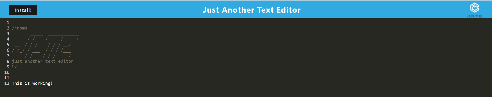

# Text Editor PWA

## Table of Contents

- [Description](#description)
- [Installation](#installation)
- [Application Overview](#application-overview)
- [Insomnia Routes](#insomnia-routes)
- [Application Documentation](#application-documentation)

## Description
Fakebook is a social media startup that provides an API for its social network using a NoSQL database. The API can handle large amounts of unstructured data, making it ideal for storing user-generated content such as posts, comments, and reactions. 

The application starts a server and syncs Mongoose models to a MongoDB database upon invocation. The API provides GET, POST, PUT, and DELETE routes for users, thoughts, reactions, and friend lists. 

Using Insomnia, users can test the API and successfully create, update, and delete users and thoughts, as well as create and delete reactions and add or remove friends from a user's friend list. 

## Installation

```
  > npm install express (express.js)
  > npm install --save-dev webpack (Webpack)
  > npm install webpack-dev-server --save-dev (webpack-dev-server)
  > npm install --save-dev webpack-pwa-manifest (WebpackPwaManifest)
  > npm install babel (Babel)
  > npm install --save-dev css-loader (CSS-loader)
  > npm install concurrently --save (run multiple commands concurrently.) (Concurrently)
  > npm npm install idb (IndexedDB)

```

## Application Overview



## Application Documentation
 * [Click here to watch this application in action!]()
* GitHub: https://github.com/MoMoncada/Text-Editor-PWA
 